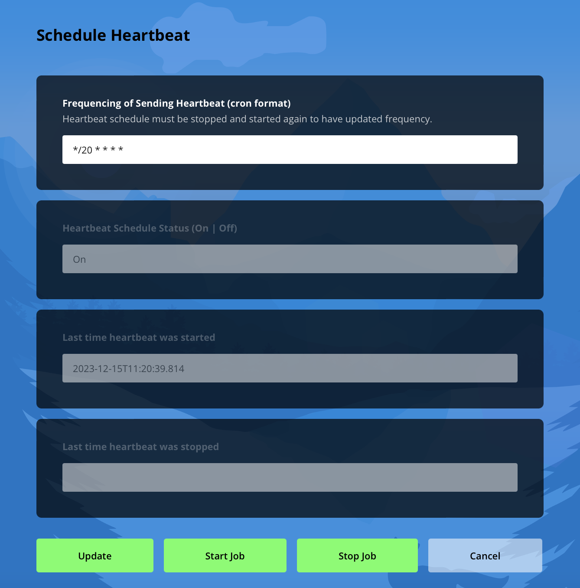

# Capstone Monitoring Project - Agent [](https://opensource.org/licenses/MIT) 

   

<small>This project is part of the Central Connecticut State University capstone requirement for graduation from the Software Engineering graduate program. Contact [John Liu](mailto:john.liu@my.ccsu.edu) or [Stivi Cangon](mailto:Stivi.Cangonj@my.ccsu.edu) for any questions.</small>
 
### A Light-weight Monitoring Solution

This can be the first step to automating your workflow to build, deploy, and maintain your applications. See the following features below. 

- ✅ Automated restart when your web application is down
- ✅ Automated notification when your web application is down
- ✅ Dashboard to see: 
    - 💪 Current status of the availability of all apps on one page 
    - 💪 Foundational DevOps metrics measuring speed and stability of your deployment to production. 

This solution will work with any application as long as your applications are hosted in a docker container.

## Prerequisites

### Monitoring Services Agent on Your Server

1. [Agent](https://hub.docker.com/r/stoicllama/capstone-local-agent/tags) is set up in the same docker network as your applications. You can configure the heartbeat content (what apps to monitor) and the heartbeat frequency (how often to send a heartbeat to the monitoring service) from the User Interface of the Agent URL (e.g., `http://<your_host_domain>:5900/`). 

2. Firewall is opened up for incoming traffic to port 5900 for the monitoring service to send a restart signal to the agent on your server.

### Applications To Be Monitored on Your Server

3. Your applications should be dockerized and placed into the same [docker network](https://docs.docker.com/engine/reference/commandline/network_create/) with the agent. 

4. Your applications should have a healthcheck end point exposed to the agent. The healthcheck end point should receive GET requests from the agent, and respond with a JSON output like so:
    ```JSON
    {
        "name":"capstone-auth",
        "message":"OK",
        "uptime":"2272883 seconds",
        "timestamp":"2023-12-08 13:05:17"
    }
    ```
    The JSON format is defined below.
    - name: String
    - message: String (OK means up, otherwise we assume it is down)
    - uptime: String (how long the app has been up since the last startup)
    - timestamp: String (when the heartbeat was generated)

    The name is critical, because this is the name that the monitoring services will send to the agent perform a `docker restart <application_container_name>`. Make sure the container name is provided to the agent.

    Timestamp is in [standard time format for JavaScript](https://developer.mozilla.org/en-US/docs/Web/JavaScript/Reference/Global_Objects/Date#date_time_string_format).

    Below is an example implementation of a healthcheck end point in an Express.js application.
    ```javascript
        // healthcheck for overall application - is the app up or not?
        // this is not api-specfic, but overall app
        // Refer here for more help on healtcheck: https://blog.logrocket.com/how-to-implement-a-health-check-in-node-js/

        const express = require('express')
        const router = express.Router()

        router.get('/', async (_req, res, _next) => {
            const healthcheck = {
                name: 'capstone-backend',
                message: 'OK',
                uptime: Math.floor(process.uptime()) + " seconds",
                timestamp: formattedDateNow() 
            };
            try {
                res.status(200).json(healthcheck);
            } catch (error) {
                res.status(500).json({
                    name: 'capstone-backend',
                    message: error.message,
                    uptime: Math.floor(process.uptime()) + " seconds",
                    timestamp: formattedDateNow() 
                });
            }
        });

        function formattedDateNow() {
            let result = "" 
            let d = new Date(Date.now())

            // format ---> 'YYYY/MM/DD hh:mm:ss SSS'
            result = result + d.getFullYear()
                        + "-"
                        + (d.getMonth()+1)
                        + "-"
                        + d.getDate().toString().padStart(2,0) 
                        + " "
                        + d.getHours().toString().padStart(2,0)
                        + ":"
                        + d.getMinutes().toString().padStart(2,0)
                        + ":"
                        + d.getSeconds().toString().padStart(2,0)

            return result;
        }

        module.exports = router;
    ```


## Installation

1. Make sure you have docker engine installed on your server. For instance, if your server is Ubuntu, you can go [here](https://docs.docker.com/engine/install/ubuntu/) for instructions on setup. 

2. Download and run the agent image as a container on your server with the `docker run` command below. Make sure to type in your docker network that your applications are in. For instance, if your network is `helpmybabies` then below type in `--network helpmybabies \`

        ```bash
            docker run -d \
                -p 5900:5900 \
                -e PORT=5900 \
                -e API_VERSION=1 \
                --rm \
                --name capstone-local-agent \
                --network <same docker network as your applications> \
                -v /var/run/docker.sock:/var/run/docker.sock \
                -v capstone_home:/var/capstone_home \
                stoicllama/capstone-local-agent:e18a02869bff2938923a9c3289793eec7836f471
        ```

    Alternatively, [here](https://hub.docker.com/r/stoicllama/capstone-local-agent/tags) is the source of the agent image if you want to download the latest agent image separately from running it.

4. Add a `config.json` and a `scheduler.json` to the root directory of the agent container. 
    1. First open a terminal from your server and run the command to enter the agent container.
        ```bash
            docker exec -it capstone-local-agent sh
        ```
    2. Second create a config.json file at the root level of the application from `/home/app`. The `/home/app` path was already set with the agent image.
        ```bash
            vim config.json
        ```
        Enter in the following values for the `config.json` file. Make sure to replace the values for the following fields. 

        - CAPSTONE_RESTART_URL - This is the URL to reach the agent container on your server. Make sure to open up port 5900 for incoming traffic.

        - CAPSTONE_CONTACT_NAME - This is the name of the support person for the applications.
        
        - CAPSTONE_CONTACT_EMAIL - This is the email of the support person for the applications.
        
        - CAPSTONE_JENKINS - This is an array, which should include the list of Jenkins pipelines that you want to monitor. Note the CAPSTONE_JENKINS URL should include the number, result, duration, and url for each build. You can use the example Jenkins URL below. 
        
        - CAPSTONE_APPS - This is the URL to the health check end point for each of your applications that you want to monitor.

        An example is pasted below. 
        ```json
            {
                "CAPSTONE_AGENT_ID": "100",
                "CAPSTONE_RESTART_URL": "http://helpmybabies.com:5900/api/v1/restart",
                "CAPSTONE_CONTACT_NAME": "John",
                "CAPSTONE_CONTACT_EMAIL": "me@stoicllama.dev",
                "CAPSTONE_MONITORING_SERVICE": "http://capstonemonitoring.xyz:3000/heartbeat",
                "localAgentEnvironment": "production",
                "metricsDashboardURL": "http://capstonemonitoring.xyz:7200/",
                "CAPSTONE_JENKINS": [
                    {
                        "name": "capstone-frontend",
                        "url": "http://<your_jenkins_host>:8080/job/capstone-frontend/api/json?tree=builds%5Bnumber,result,duration,url%5Bparameters%5Bname,value%5D%5D%5D"
                    },
                    {
                        "name": "capstone-backend",
                        "url": "http://<your_jenkins_host>:8080/job/capstone-backend/api/json?tree=builds%5Bnumber,result,duration,url%5Bparameters%5Bname,value%5D%5D%5D"
                    },
                ],
                "CAPSTONE_APPS": [
                    {
                        "name": "capstone-frontend",
                        "url": "http://<your_app_host>/healthcheck"
                    },
                    {
                        "name": "capstone-backend",
                        "url": "http://<your_app_host>/healthcheck"
                    },
                ],
                "lastUpdated": "2023-11-29 21:58:55"
            }
        ```

        When you have pasted the values into the screen, type `:wq` and click Enter key on your keyboard to save and exit the file.

    3. Third create a `scheduler.json` file at the root level of the application from `/home/app`. The `/home/app` path was already set with the agent image.
        ```bash
            vim scheduler.json
        ```

        Paste in the following values into the file.
        ```bash
            {
                "freq": "*/5 * * * *",
                "scheduledStatus": "Off",
                "lastStart": "",
                "lastStop": "2023-11-23 21:09:53",
                "lastUpdated": "2023-11-23 21:09:53"
            }
        ```

        When you have pasted the values into the screen, type `:wq` and click Enter key on your keyboard to save and exit the file.

        Note the `freq` field has the value `*/5 * * * *` as a standard cron job configuration. This default means that the agent container will run every 5 minutes against the healthcheck of each application, and then send it to the monitoring service publisher for storage. You can change this later from the agent user interface at this URL `http://<your_host>:5900/scheduler.html`.

5. Open a web browser on your local device to connect to the server, and go to `http://<your_host>:5900/scheduler.html` to start the heartbeat scheduler. Click on `Start Job` to start. You can always stop the job by clicking on `Stop Job` from the same page. Note here the cron frequency was changed to every 20 minutes for this particular instance.

    